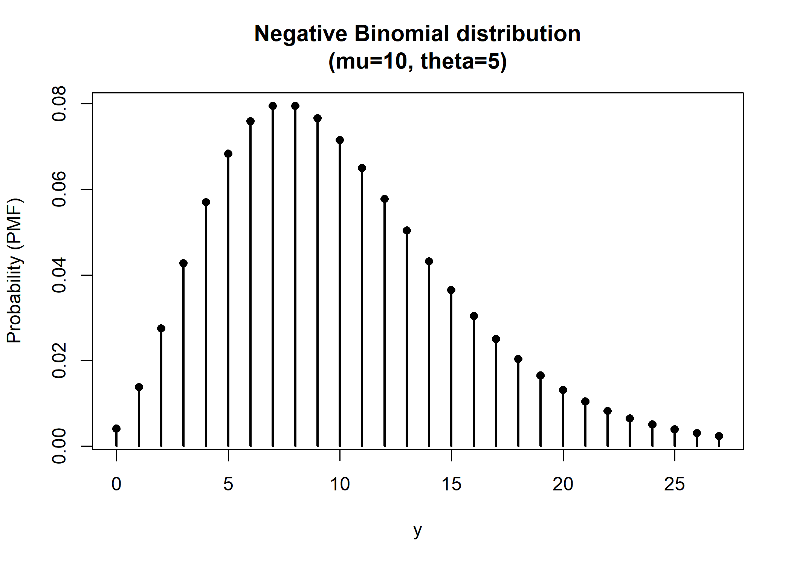

<!-- README.md is generated from README.Rmd. Please edit that file -->

# distrib

<!-- badges: start -->

<!-- badges: end -->

The goal of `distrib` is to provide a unified, object-oriented framework
for probability distributions in R.

Unlike standard R distribution functions (e.g., `dnorm`, `pnorm`),
`distrib` wraps each distribution into a standardized S3 object that
includes:

- **Analytical Derivatives**: Gradients and Hessians (observed and
  expected) ready for Maximum Likelihood Estimation.

- **Link Functions**: Built-in handling of parameter link functions (via
  the `linkfunctions` package).

- **Validation Tools**: Utilities to automatically verify analytical
  derivatives against numerical approximations.

## Installation

You can install the development version of distrib from
[GitHub](https://github.com/) with:

``` r
# install.packages("pak")
pak::pak("giovannitinervia9/distrib")
```

## Example

This is a basic example showing how to initialize a distribution and
interact with its methods.

### 1. Initialize a Distribution

Let’s use the Negative Binomial distribution (NB2 parametrization).

``` r
# Initialize the distribution object
nb <- negbin_distrib()

# The print method gives a clear summary of parameters and domains
nb
#> Distribution: Negative Binomial
#> Type:         Discrete
#> Dimensions:   1
#> 
#> Parameters:
#>   mu    (mean)               | Link: log        | Domain: (0, Inf)
#>   theta (dispersion)         | Link: log        | Domain: (0, Inf)
```

### 2. Compute Probabilities and Derivatives

You can compute the log-likelihood, gradient, and Hessian for specific
data and parameters.

``` r
# Define parameters
theta <- list(mu = 10, theta = 5)

# Generate synthetic data
set.seed(123)
y <- nb$rng(n = 5, theta = theta)

# Compute Log-Likelihood contributions
ll <- nb$loglik(y, theta)
head(ll)
#> [1] -2.638958 -3.688957 -3.312479 -2.684105 -2.532225
sum(ll)
#> [1] -14.85672

# Compute Analytical Gradient (Score)
grad <- nb$gradient(y, theta)
str(grad)
#> List of 2
#>  $ mu   : num [1:5] 0 0.2333 0.1667 -0.1667 -0.0667
#>  $ theta: num [1:5] 0.06962 -0.00325 0.03246 -0.01964 0.0546

# Compute Analytical Hessian (Observed)
hess <- nb$hessian(y, theta, expected = FALSE)
str(hess)
#> List of 3
#>  $ mu_mu      : num [1:5] -0.03333 -0.07222 -0.06111 -0.00556 -0.02222
#>  $ theta_theta: num [1:5] -0.01905 -0.01038 -0.0145 -0.00505 -0.01692
#>  $ mu_theta   : num [1:5] 0 0.03111 0.02222 -0.02222 -0.00889
```

### 3. Visualization

The package includes a generic `plot` method to visualize the PDF/PMF
instantly.

``` r
# Visualize the PMF for the given parameters
plot(nb, theta)
```



### 4. Validation

A key feature of `distrib` is the ability to self-validate. You can
check if the analytical gradients and Hessians match numerical
approximations (using finite differences).

``` r
# Check analytical derivatives against numerical ones
check_derivatives_distrib(nb, n = 10)
#> ----------------------------------------------------
#> Distribution: negative binomial 
#> Max Relative Error (Grad):  8.10241e-11 
#> Max Relative Error (Hess):  7.70490e-10 
#> 
#> [OK] Analytical derivatives match numerical ones.
#> ----------------------------------------------------
```

``` r
# Check expected hessian via Monte-Carlo simulation
check_expected_hessian_distrib(nb, n_sim = 100000, theta = theta)
#> ----------------------------------------------------
#> Distribution: negative binomial 
#> Parameters:   mu=10, theta=5 
#> Samples:      1e+05 
#> 
#>   mu_mu           | Exp:  -0.03333 | Mean Obs:  -0.03345 | RelErr: 3.37e-03
#>   theta_theta     | Exp:  -0.00858 | Mean Obs:  -0.00852 | RelErr: 7.85e-03
#>   mu_theta        | Exp:   0.00000 | Mean Obs:   0.00009 | AbsErr: 8.99e-05
#> 
#> [OK] Expected Hessian aligns with Mean Observed Hessian.
#> ----------------------------------------------------
```
